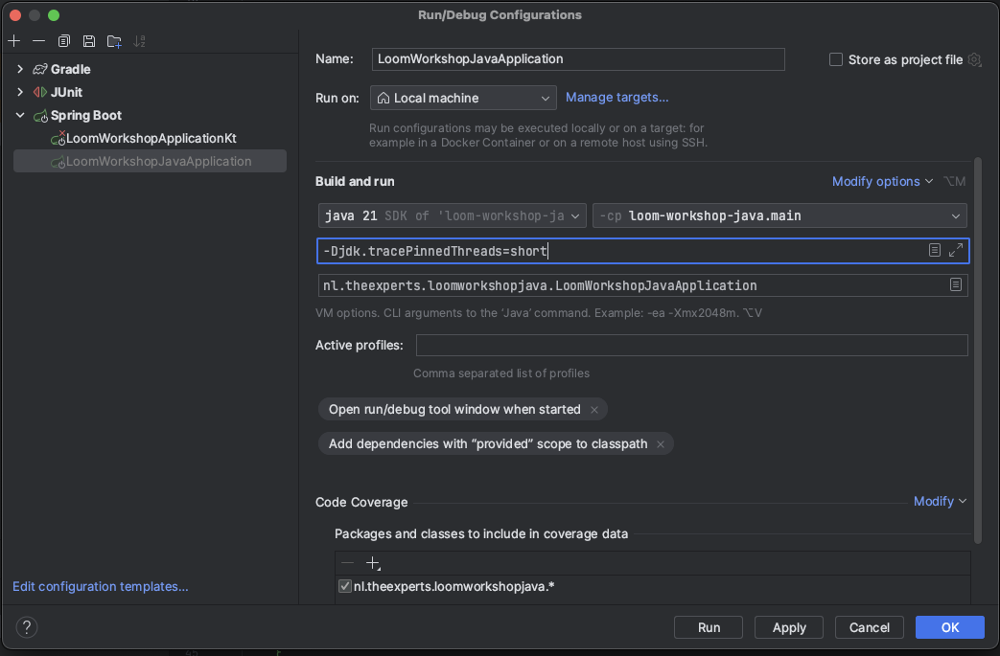

### Assignment 2.1: Exploration of Pinned Threads and Performance Optimization

Now that you have successfully refactored the application to use virtual threads, let's delve into a new challenge. You might encounter scenarios where certain operations still don't play well with virtual threads, leading to performance degradation. One such operation is the use of synchronized blocks. In this assignment, you will explore how synchronized blocks can pin threads, and how to resolve this issue.

1. **Identifying the Issue:**
    - In the `processLargeDataSet` method, comment the `intensiveComputation` function call and replace it with `intensiveComputationPinned`.
    - Run the project tests, load tests, and observe the JConsole views to analyze the impact on performance.
    - Notice the significant slowdown? Let's investigate why this is happening.

2. **Enabling `tracePinnedThreads`:**
    - Enable `tracePinnedThreads` in the `build.gradle.kts` to help identify pinned threads during execution. 
    - Add the jvm argument `-Djdk.tracePinnedThreads=short` to the **IntelliJ build config** .
   - If you run the application directly with gradle: update your build script as follows:
        ```kotlin
        tasks.withType<BootRun> {
            jvmArgs("-Djdk.tracePinnedThreads=short")
        }
        ```
   
    - Run the application again and check the logs for messages related to pinned threads.
    - You should see warnings about pinned threads which are making your application slow again.

3. **Understanding Pinned Threads:**
    - Pinned threads occur when a virtual thread is bound to a platform thread due to certain operations, like synchronized blocks. This binding negates the benefits of virtual threads, leading to performance issues.

4. **Refactoring `synchronized` blocks:**
    - In scenarios where you can't remove a `synchronized` block, consider refactoring the code to use locks instead.
    - Replace the `synchronized` block in the `intensiveComputationPinned` method with a lock, using the `java.util.concurrent.locks.Lock` interface.
    - Try to refactor the code in a way that the lock is only held for the duration of the intensive computation.

5. **Analyzing the Impact:**
    - Run the tests, load tests, and observe the JConsole views again to analyze the performance impact of this change.
    - Locks are optimized for virtual threads and should not pin down your platform thread, thereby restoring the performance benefits of virtual threads.
    - Compare the performance metrics now with the previous setup and observe the improvements.

6. **Conclusion:**
    - Reflect on how replacing `synchronized` blocks with locks has impacted the performance of your application.
    - Understanding how certain operations interact with virtual threads and being able to optimize them is crucial for getting the most out of Project Loom.